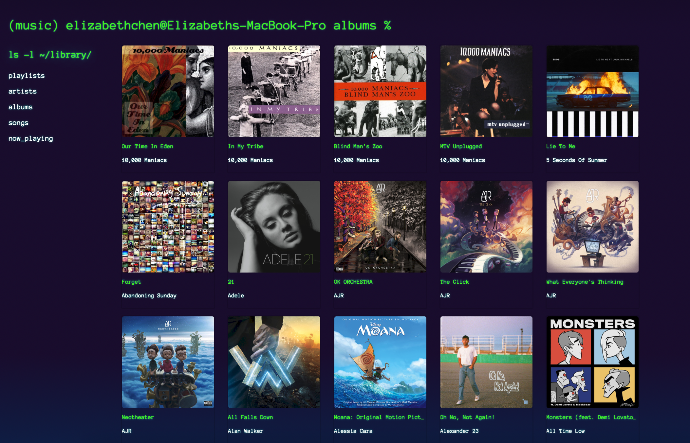
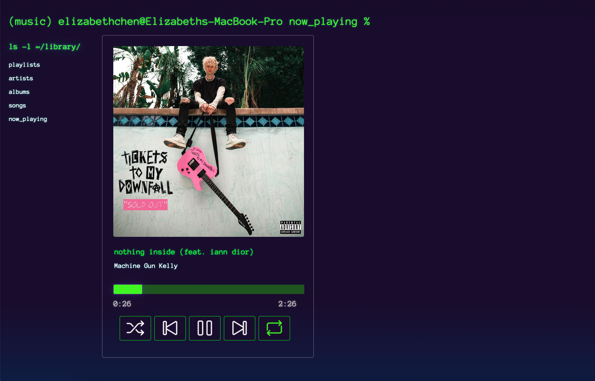

# Muse Player - WIP!!!
Terminal geek-chic themed home for your owned music library running in Flask with MongoDB. 2025 revival of my lil abandoned pandemic hobby project.

### Highlights 

## Plans - 2025

#### In-Progress Features
- [ ] Fully-functional basic media player
- [ ] Implementing playlists
    - [ ] Playlist storage in DB
    - [ ] Playlist creation via UI
    - [ ] Playlist x media player functionality 
- [ ] Implement ability to like a song 
    - [ ] Update UI - change to filled heart
    - [ ] Update song/album in DB
- [ ] Implement queue and smart shuffle based on favorited songs

### Later
- [ ] Clean up DB loading and file storage schema (simplify? how to play nicely with Apple's Music app so my iPod doesn't get messed up)

### Future
- Interactive taste analysis dashboard
- Historical play statistics (last.fm-style)
- Self-hosted cloud-based streaming